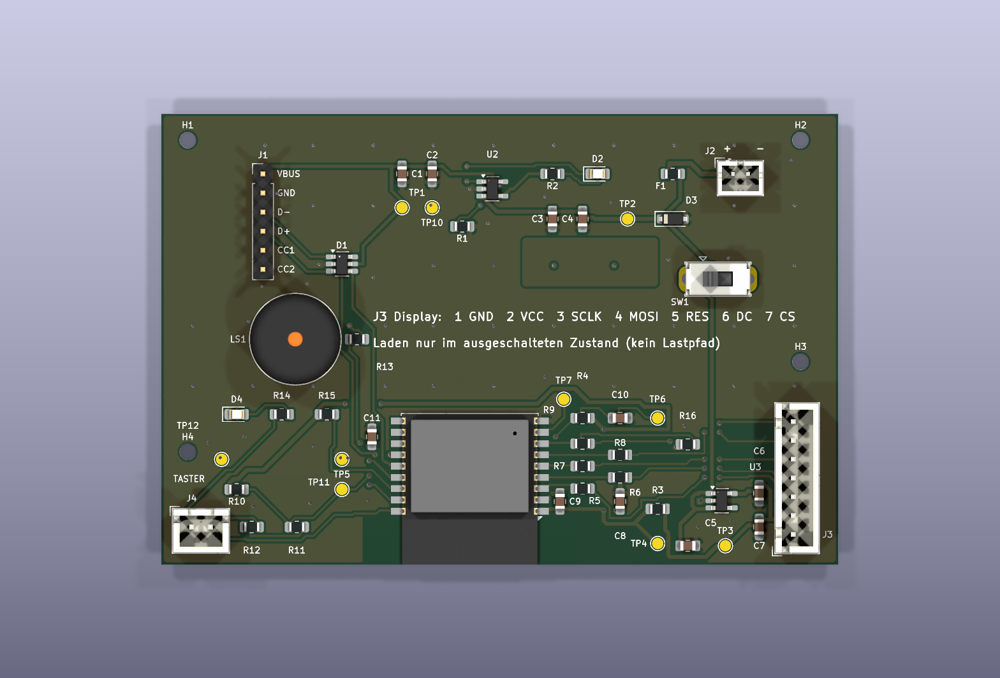

# Flappy Bird auf ESP32-C3 — Bachelorprojekt HAW Hamburg

Hardware zum Projekt „Flappy Bird auf eigener ESP32-Baugruppe": zweilagige
Leiterplatte 90 × 60 mm, unbestückt zu beziehen und von Hand zu bestücken,
Display und Taster über JST-XH-Steckverbinder abgesetzt.



## Alles erzeugen und prüfen

```bash
cd hardware && ./erzeugen.sh
```

Acht Schritte: Bibliotheken, Schaltplan, Platzierungsprüfung, Verdrahtung,
ERC und Netzlistenabgleich, Masseflächen füllen und DRC, Fertigungsunterlagen,
Prüfstand.

| Prüfung | Ergebnis |
|---|---|
| ERC des Schaltplans | **0 Verstöße** |
| DRC des Layouts | **0 Fehler** |
| offene Verbindungen | **0** |
| Abgleich Schaltplan ↔ Layout | **0 Abweichungen** |
| Netzliste gegen `gen/design.py` | **identisch** (34 Netze, 129 Pinverbindungen) |
| Prüfstand Stufe 1 und 2 | **1664 Prüfungen, 0 Fehler** |
| Reproduzierbarkeit | zweimal erzeugen ergibt bitgleiche Dateien |
| Fehlererkennung | 8 von 8 eingebauten Fehlern gefunden |

## Verzeichnisse

```
hardware/
  flappy-esp32c3.kicad_pro / .kicad_sch / .kicad_pcb   Projektdateien
  erzeugen.sh                     erzeugt und prüft alles neu
  gen/                            Quellen des Entwurfs
  gen/tests.py, tests_stufe3.py   Prüfstand
  lib/                            projekteigene Symbole und Footprints
  doc/pruefbericht.md             Entwurfsprüfung: Befunde, Fläche, Gehäuse
  doc/pruefstand.md               was der Prüfstand prüft
  doc/pinbelegung.md              GPIO-Belegung, verbindlich für die Firmware
  doc/entscheidungen.md           Entwurfsentscheidungen und Abweichungen
  doc/inbetriebnahme.md           gestuftes Protokoll nach Projektplan 4.5
  ausgabe/                        Schaltplan-PDF, Layout-PDF, Stückliste, 3D-Bild
  fertigung/                      Gerber, Bohrdaten, Bestückungsdatei
```

## Kennzahlen

| | |
|---|---|
| Platine | 90 × 60 mm, zwei Lagen, 1,6 mm |
| Bauteile | 55 (41 bestückt, 10 Prüfpunkte, 4 Bohrungen M2) |
| Leiterbahnen | 371 Segmente, 843 mm; davon 8,4 % auf der Rückseite |
| Durchkontaktierungen | 113, davon 82 Masse |
| kleinste Bahn / kleinster Abstand / kleinste Bohrung | 0,25 mm / 0,20 mm / 0,30 mm |
| Massefläche Rückseite | 4904 mm², **eine** zusammenhängende Fläche |
| Kühlfläche am Laderegler | 114 mm² (Projektplan 5.2 fordert ≥ 100 mm²) |

## Wie der Entwurf entsteht

Schaltplan und Layout sind **erzeugt**, nicht von Hand gezeichnet. Einzige
Wahrheitsquelle ist `gen/design.py` mit Bauteilen und Netzliste. Wer eine
Schaltungsänderung braucht, ändert diese Datei und lässt `./erzeugen.sh`
laufen — Schaltplan, Layout, Prüfungen und Fertigungsdaten entstehen neu.

Wer lieber in KiCad weiterzeichnet, kann das jederzeit tun; dann sollte
`erzeugen.sh` nicht mehr aufgerufen werden, sonst werden die Handänderungen
überschrieben.

## Vor der Bestellung

Drei Punkte am **gekauften** Bauteil nachmessen, siehe
`hardware/doc/entscheidungen.md` Abschnitt 3:

1. Pinbelegung des USB-C-Breakouts (erwartet VBUS, GND, D−, D+, CC1, CC2)
2. Aderfolge des OLED-Moduls
3. Bauform des Schiebeschalters

## Werkzeug

KiCad 10. Der Generator schreibt das KiCad-9-Format; der Füllschritt lässt
KiCad die Platine in seinem eigenen Format zurückschreiben. Die Datei im
Repository liegt daher im KiCad-10-Format. Wer KiCad 9 benutzt, lässt
`erzeugen.sh` einmal auf seinem Rechner laufen. Für den Verdrahter wird
zusätzlich NumPy gebraucht.
